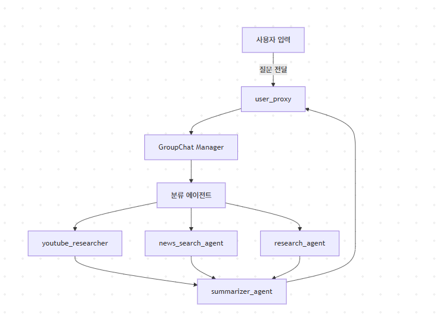

# Agent-Report

# 🤖 Multi-Agent Intelligence Report Server

## 🤝 조원

<table>
  <tr>
    <th>프로필</th>
    <th>이름</th>
    <th>GitHub</th>
  </tr>
  <tr>
    <td></td>
    <td>김실희</td>
    <td><a href="https://github.com/siL-rob">siL-rob</a></td>
  </tr>
  <tr>
    <td></td>
    <td>박승현</td>
    <td><a href="https://github.com/hbjb30516">hbjb30516</a></td>
  </tr>
  <tr>
    <td></td>
    <td>황의철</td>
    <td><a href="https://github.com/UICHEOL-HWANG">UICHEOL-HWANG</a></td>
  </tr>
</table>


**문서 요약 · 뉴스 검색 · 유튜브 리서치**  
Streamlit과 AutoGen 기반 멀티 에이전트 시스템으로, 다양한 정보 요청을 자동 분류하고, 특화된 에이전트를 통해 요약 리포트를 생성해주는 서비스입니다.

## 디렉토리 구조 

```bash
service/
└── src/
    ├── agent_manager.py      # 멀티 에이전트 정의
    ├── config.py             # LLM 설정 로딩
    ├── group_chat.py         # GroupChat 객체 및 구성
    ├── tools.py              # 이메일, 외부 API 도구
    ├── type_schemas.py       # 타입 정의 (선택적)
    └── main.py               # Streamlit 진입점

.env                          # 환경 변수 파일
README.md                     # 프로젝트 설명

```

## 🧩 멀티 에이전트 구조


## 🚀 주요 기능

- 🧠 **멀티 에이전트 기반 자동 응답 시스템**  
  사용자 질문을 카테고리에 따라 자동 분류하고, 각 전문 에이전트가 응답 생성

- 📄 **문서 요약, 뉴스 요약, 유튜브 요약 지원**  
  - `youtube_research`: 유튜브 영상 검색 및 스크립트 요약  
  - `news_search_agent`: 최신 뉴스 검색 및 요약  
  - `research_agent`: 일반 정보 검색 (Tavily API 기반)

- 📬 **요약 보고서를 이메일로 전송**  
  생성된 리포트를 원하는 이메일로 전송 가능

- 🧾 **Streamlit UI 제공**  
  직관적인 채팅 UI, 대화 히스토리, 리포트 전송 등 편의 기능 제공

---

## 🛠️ 사용 기술

- Python 3.10+
- Streamlit
- Microsoft AutoGen
- OpenAI API
- 이메일 전송 (SMTP)
- Serper 뉴스 API, Tavily 검색 API, YouTube API

---

